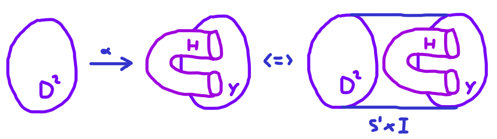
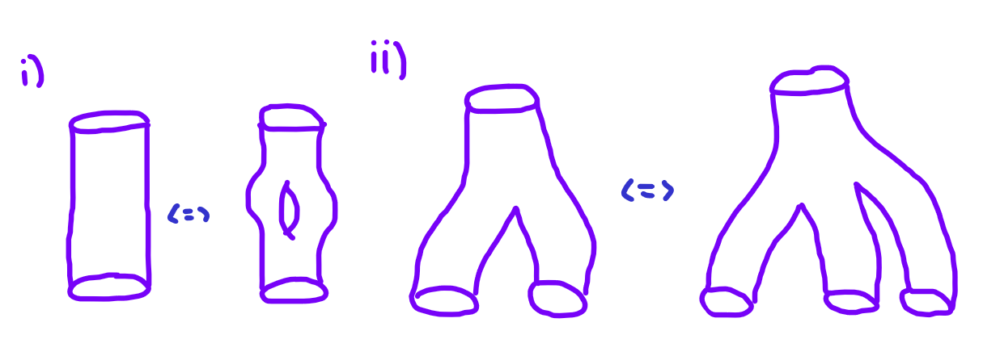
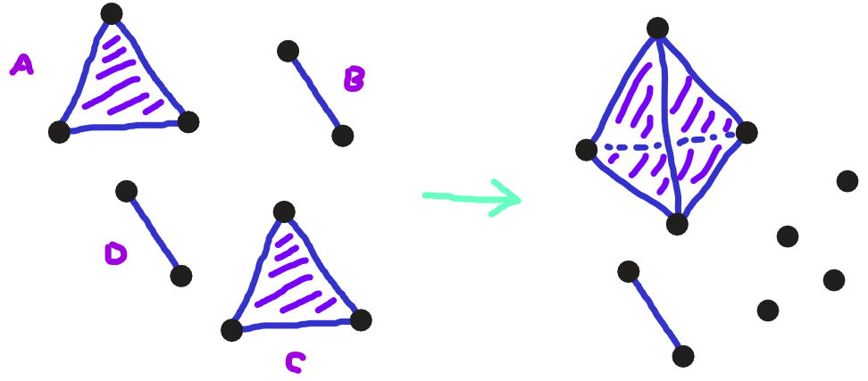

# Continuous Network Histories as Cobordisms
   We view each closed consensus network's time‐unfolding as a manifold $$\mathcal{M}$$ with boundary components its initial and final complexes.  Transitions (splits/merges) appear as cobordisms (§2.2.1) between slices of constant "network time."

> Sub-repository of Topological Consensus Networks: continuous‐time and continuous‐space formulations, history cobordisms, and multiscale homology of network evolution.

---

## Overview

While the core TCN framework (§2.1–2.1.3 in the main repo) treats consensus networks as evolving simplicial complexes over a discrete trust filtration, these continuous‐topology extensions (§2.2 of the Full, Old draft) lift that picture to a continuum:

1. **Network Histories as Cobordisms**  
   We view each closed consensus network’s time‐unfolding as a manifold $$\mathcal{M}$$ with boundary components its initial and final complexes.  Transitions (splits/merges) appear as cobordisms (§2.2.1) between slices of constant “network time.”

2. **Combinatoric History Scaling**  
   By discretizing the continuous history at increasingly fine time‐resolutions, we build an inverse system of simplicial complexes whose limits capture large‐scale network reconfigurations (§2.2.2).

3. **Topological Invariants of Histories**  
   Persistent homology in time (§2.2.3) yields *worldsheet* Betti numbers, $$\beta_n(\mathcal{M})$$, encoding the stability and recombination patterns of consensus over long runs.

Below we detail the mathematical setup, key equations, algorithmic pseudocode, and placeholder figures to integrate into your repo—feel free to renumber or rename these as needed.

---

## 1. Network Histories and Cobordisms

Let each discrete consensus network at time $$t$$ be an abstract simplicial complex $$\mathfrak{C}(t)$$ immersed in a trust‐metric space. As $$t$$ varies continuously, the union  

$$\mathcal{M} = \bigcup_{t\in[0,T]} \{t\}\times \mathfrak{C}(t)$$

is a manifold with boundary 

$$\partial\mathcal{M} \;=\; \mathfrak{C}(0)\;\bigsqcup\;\mathfrak{C}(T).$$

A *cobordism* is an equivalence relation on the class of compact manifolds of the same dimension, providing a set of instructions for a manifold $$M$$ to evolve over time into another manifold $$N$$ while preserving their boundaries. Splittings or recombinations of networks appear as cobordisms between level sets:

$$\mathfrak{C}(t_1)\;\sim_{\mathrm{cob}}\;\mathfrak{C}(t_2)
   \quad\Longleftrightarrow\quad
   [t_1,t_2]\times\mathfrak{C}\subset \mathcal{M}.$$

For topological consensus networks, these cobordisms represent the continuous evolution arising from trust dynamics, capturing how networks bifurcate due to breaches in trust and potentially recombine later.
<figure>
  
  <figcaption>Figure 1. A sketch of network history $$\mathcal{M}$$ as a cobordism between initial and final complexes. Here we see a cobordism between a disk and a modified disk with a handle, characterizing how network topology evolves through time.</figcaption>
</figure>

---

## 2. Combinatoric Scaling of Histories

To algorithmically handle continuous time, we sample the history at $$N$$ discrete timestamps,

$$0 = t_0 < t_1 < \cdots < t_N = T,$$

and form complexes $$\mathfrak{C}_k = \mathfrak{C}(t_k)$$. The *history complex* is then the union of prisms

$$\mathrm{H}_N(\mathcal{N}) = \bigcup_{k=1}^N \bigl[t_{k-1},t_k\bigr] \times \mathfrak{C}_k.$$

This discrete approximation allows us to capture the manifold structure through a sequence of simplicial slices. The history of a network is not uniquely determined by its boundary conditions alone—there exists a degeneracy where different histories can have identical boundary conditions. This reflects real-world scenarios where networks may split and recombine through various intermediate states but arrive at the same final configuration.

As $$N\to\infty$$, these discrete approximations converge (in the Vietoris–Rips sense) to the continuous manifold $$\mathcal{M}$$, capturing all topological features of the network's evolution.

**Algorithm 1.** Discrete history construction  
```python
def build_history_complex(complexes, times):
    """
    complexes: list of SimplicialComplex at times t_0...t_N
    times:      list of floats t_0...t_N
    Returns: HistoryComplex = union of prisms [t_{k-1},t_k] x complexes[k]
    """
    history = []
    for k in range(1, len(times)):
        Prism = make_prism(complexes[k-1], complexes[k], times[k-1], times[k])
        history.append(Prism)
    return UnionOfPrisms(history)
````

<figure>
  
  <figcaption>Figure 2. Visualization of boundary condition degeneracy. Different network histories can have the same boundary conditions, demonstrating how sampling at different time resolutions reveals the full structure of network evolution.</figcaption>
</figure>

---

## 3. Persistent Homology of Histories

We compute *worldsheet* persistent homology on the history complex $$\mathrm{Hist}_N(\mathcal{N})$$ to extract topological invariants that characterize trust dynamics:

1. Define a height function $$h: \mathrm{Hist}_N \to [0,T]$$ by projection onto the time coordinate.
2. Build a sublevel filtration $$F_\tau = h^{-1}([0,\tau])$$ for $$\tau\in[0,T]$$.
3. Compute persistence diagrams $$\mathrm{Dgm}_n$$ for each dimension $$n=0,1,2,\dots$$.

These topological invariants quantify the distrust or trust in network histories through measures such as genus $$g$$ and Euler characteristic $$\chi$$, where the distrust of a consensus network history is defined as:

$$ r(\mathcal{H}) = 1 - \frac{1}{2}\chi(\mathcal{H}) $$

Key invariants from persistence homology:

* $$\beta_0(\tau)$$: number of connected worldsheet components (independent network segments through time).
* $$\beta_1(\tau)$$: loops in the history (network splits that recombine).
* Global Betti numbers: $$\beta_n(\mathrm{Hist}_N)$$ as $$\tau\to T$$ tracks long‐term trust stability.

**Equation (3.1).** Worldsheet homology groups

$$ H_n\bigl(\mathrm{Hist}_N\bigr) = \bigoplus_{(b,d)\in \mathrm{Dgm}_n} \Bbbk\,,$$

with $\Bbbk$ the field coefficients.

**Algorithm 2.** Compute history persistent homology

```python
import gudhi as gd

def history_persistence(history_complex):
    # Build filtered complex via height function
    simplex_tree = gd.SimplexTree()
    for prism in history_complex.prisms:
        for sigma in prism.simplices:
            height = max(vertex.time for vertex in sigma)
            simplex_tree.insert(sigma.vertices, filtration=height)
    simplex_tree.initialize_filtration()
    return simplex_tree.persistence()
```

<figure>
  
  <figcaption>Figure 3. Interaction diagram of network histories showing how topological consensus networks can split and recombine. These patterns form the basis for persistent homology analysis, where loops signify network splits that later recombine.</figcaption>
</figure>

---

## 4. Convergence & Continuum Limits

As $$N\to\infty$$, the finite approximations $$\mathrm{Hist}_N$$ converge under the bottleneck distance to the true manifold. By stability of persistence,

$$d_B\bigl(\mathrm{Dgm}_n(\mathrm{Hist}_N), \mathrm{Dgm}_n(\mathcal{M})\bigr)\;\le\; \|h_N - h\|_\infty\;\xrightarrow[N\to\infty]{} 0.$$

For combined network histories $$\mathcal{H}_i$$ and $$\mathcal{H}_j$$ that have been glued along open subsets with diffeomorphisms $$\phi: \partial\mathcal{H}_i \to \partial\mathcal{H}_j$$, the distrust of the combined history is given by:

$$
r(\mathcal{H}_i \cup_\phi \mathcal{H}_j) = 1 - \frac{1}{2}\bigg(\chi(\mathcal{H}_i) + \chi(\mathcal{H}_j) - \chi(\partial\mathcal{H}_i)\bigg)
$$

This formula quantifies how trust changes when network histories interact, providing a mathematical foundation for autonomous network combination based on trust criteria.

---

## 5. Network-Client Trust Intersection

For networks to serve clients in transaction verification, we must consider the intersection of trust between network and client perspectives. This is necessary because the network's local conception of trust may not coincide with the client's external independent conception of trust among nodes.

For a client to use a network service, they evaluate:
1. Which sub-networks they trust (client perspective)
2. Which sub-networks are trusted by the network itself (network perspective)
3. The intersection of these trust assessments

A binary decision function for network histories can be defined as:

$$f_{\mathcal{H}}(\mathcal{Q}) = 
\begin{cases}
1,\, r(\mathcal{Q}) \leq \delta_{\mathcal{H}} \\
0,\, r(\mathcal{Q}) > \delta_{\mathcal{H}}
\end{cases}$$

where $$\delta_{\mathcal{H}}$$ is a security parameter agreed upon by the network based on its history.

<figure>
  
  <figcaption>Figure 4. Network-Client trust intersection. The trusted components from both perspectives form the basis for secure transaction verification services.</figcaption>
</figure>

---

## 6. Implementation and Integration

The continuous-topology framework integrates with the discrete TCN codebase in the following ways:

1. **Bridging Classical and Quantum Domains**
   * The cobordism model allows unified treatment of both classical and quantum network partitioning
   * Continuous topology provides a natural interface to quantum random processes used in network allocation

2. **Algorithmic Structure**

```python
class NetworkHistoryTracker:
    def __init__(self, initial_complex):
        self.history = [initial_complex]
        self.timestamps = [0.0]
        
    def add_timestep(self, complex, time):
        self.history.append(complex)
        self.timestamps.append(time)
        
    def build_cobordism_manifold(self):
        return build_history_complex(self.history, self.timestamps)
        
    def compute_persistence(self):
        history_complex = self.build_cobordism_manifold()
        return history_persistence(history_complex)
        
    def get_trust_metric(self):
        # Compute genus/Euler characteristic from persistence
        dgms = self.compute_persistence()
        # Calculate Betti numbers
        betti_0 = len([p for p in dgms[0] if p[1] == float('inf')])
        betti_1 = len([p for p in dgms[1] if p[1] == float('inf')])
        euler_char = betti_0 - betti_1
        # Trust as inverse of genus
        genus = 1 - euler_char/2
        return 1.0 / (1.0 + genus)  # Normalized trust metric
```

3. **Repository Integration**
   * The Continuous Topology extension complements both `Classical Algorithms` and `Quantum Algorithms` directories
   * Shared visualization tools in `Visualizer` can be extended to display cobordism manifolds and persistence diagrams

<figure>
  
  <figcaption>Figure 5. Construction of a total network complex from constituent subjective complexes, showing how individual trust perspectives combine into a global network structure.</figcaption>
</figure>

---

## 7. Future Research Directions

The continuous-topology framework opens several research avenues:

1. **Higher-dimensional Generalizations**
   * Extend to $n$-dimensional cobordisms for multi-faceted trust metrics
   * Incorporate transaction types as additional topological dimensions

2. **Quantum Topological Data Analysis**
   * Quantum algorithms for accelerated computation of persistent homology
   * Quantum random network partitioning with topological protection

3. **Scalability Studies**
   * Theoretical bounds on network size vs. topological complexity
   * Optimization of history tracking for large-scale distributed systems

<figure>
  
  <figcaption>Figure 6. Visualization of network partitioning based on trust dynamics. The initial distribution (left) evolves to maximize trust in each subnetwork (right).</figcaption>
</figure>

