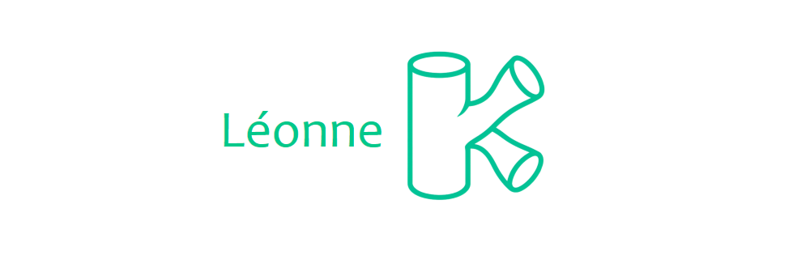

<h4 align="center">Modular Consensus Networks</h4>

Léonne (IPA: /leɪˈɔn/) is a collection of topological algorithms that computes cryptographic proof for multiple simulated blockchain transactions using modular consensus networks. It is designed with post-quantum protocols that take into account network histories and dynamically partitions networks to optimize consensus rates while being robust to dishonest parties colluding to have majority.  

## Table of Contents

- [Getting Started](#getting-started)
- [Features](#features)
- [Installation](#installation)
- [License](#license)

## Getting Started

Léonne enables you to run consensus and network partitioning algorithms for a collection of known consensus networks with the goal of performing parallel cryptographic proof for simulated multi-blockchain environments. 

- Visit our [algorithms modules](https://github.com/btq-ag/Leonne/tree/main/Algorithm%20Modules) to get started with consensus protocols.
- Visit the [theoretical showcase](https://github.com/btq-ag/Leonne/blob/main/Theory%20Showcase/Topological%20Consensus%20Networks.pdf) which represents the mathematical and algorithmic background needed to run the algorithms.

## Features

* Built-in topological trust partitioning to give you intelligent consensus features such as: autonomous splitting, diagnostics and recombination.
* Modal consensus modes supported as first class citizen (Proof-of-Consensus, and toggleable)
* Built-in remote development support inspired by distributed test-nets. Enjoy the benefits of a "local" experience, and seamlessly gain the full power of a remote cluster.
* Built-in analytics terminal, so you can execute trust-related commands in your workspace without leaving Léonne.

## Installation

All of Léonne's protocols can be run locally in Windows, Linux and macOS given local blockchain simulations with Python. See [Getting Started](#getting-started) for where to begin.

## License

Léonne is released under the license and copyright of _BTQ Technologies_. You may use the code as you please as long as you adhere to its conditions. You can find a copy of the license text here: [LICENSE](https://github.com/btq-ag/Leonne/License).
